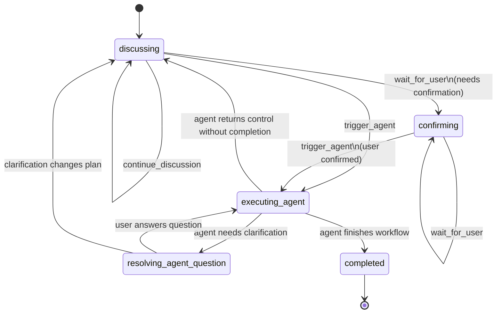

# Protocol v1

This document defines the v1 conversation protocol for the voice-first orchestrator.

The goal is to keep the user in one continuous conversation while the orchestrator manages:
- discussion
- confirmation
- agent execution
- agent clarification
- completion

The LLM returns both:
- user-facing text
- machine-actionable control data

The orchestrator consumes that control data and decides what to do next.

## Design goals

- One user-facing conversation loop
- Text-only assistant replies
- Structured control output from the LLM on every turn
- Agent triggering without a separate user-visible loop
- Safe suspend/resume when an agent needs clarification

## Core model

At a high level:

1. User speaks
2. STT produces a finalized user turn
3. The turn goes to the LLM
4. The LLM returns:
   - `assistant_message`
   - `orchestrator`
5. The orchestrator:
   - prints `assistant_message`
   - updates internal state
   - waits for user input, triggers an agent, or completes

## State machine



## Orchestrator-owned state

This state is held in memory by the orchestrator. It is not part of the LLM protocol.

- `conversation_state`
- `current_plan`
- `confirmation_status`
- `active_agent`
- `agent_context`
- `suspended_agent_state`

Example:

```json
{
  "conversation_state": "resolving_agent_question",
  "current_plan": "Generate a deployment diagram and attach it to the markdown.",
  "confirmation_status": "confirmed",
  "active_agent": "diagram",
  "agent_context": {
    "session_dir": "/Users/mridula/transcript/example_session"
  },
  "suspended_agent_state": {
    "diagram": {
      "description": "Deployment diagram for the API system",
      "last_d2_syntax": "direction: right\nclient -> api\napi -> db",
      "attempt_count": 2,
      "last_render_error": "unknown shape"
    }
  }
}
```

Important:
- the LLM may indicate which agent is waiting
- the orchestrator alone owns in-progress agent execution state

### Suspend/resume ownership

When an agent cannot proceed without more user input, the agent must signal that explicitly to the orchestrator.

The orchestrator then:
- stores or updates `suspended_agent_state`
- transitions to `resolving_agent_question`
- asks the user the blocking question
- resumes the suspended agent once the user answers

Important:
- agent suspension is agent-driven, not inferred from free-form LLM prose
- the LLM may indicate which agent is active or waiting
- only the orchestrator owns the suspended execution state blob

## Top-level response schema

The LLM must return exactly one JSON object.

```json
{
  "assistant_message": "I think we should generate the deployment diagram next. Do you want me to proceed?",
  "orchestrator": {
    "state": "confirming",
    "next_action": "wait_for_user",
    "needs_confirmation": true,
    "plan_summary": "Generate a deployment diagram and attach it to the markdown.",
    "agent_to_trigger": null,
    "agent_input": null,
    "question_for_user": "Should I generate the deployment diagram now?"
  }
}
```

## Field definitions

### `assistant_message`

Type:
- `string`

Meaning:
- The exact user-facing text printed to the terminal.

Rules:
- Required
- Must be non-empty
- Must not contain machine-only instructions

### `orchestrator`

Type:
- `object`

Meaning:
- Machine-readable control data for the orchestrator.

Rules:
- Required

## Orchestrator fields

### `state`

Type:
- `string`

Allowed values:
- `discussing`
- `confirming`
- `executing_agent`
- `resolving_agent_question`
- `completed`

### `next_action`

Type:
- `string`

Allowed values:
- `continue_discussion`
- `wait_for_user`
- `trigger_agent`
- `complete`

Meaning:
- What the orchestrator should do immediately after displaying `assistant_message`.

### `needs_confirmation`

Type:
- `boolean`

Meaning:
- Whether the next user turn is expected to confirm or reject the current plan/action.

### `plan_summary`

Type:
- `string | null`

Meaning:
- Compact current summary of the plan or agreed intent.

Purpose:
- stabilize context
- support resume
- give agents a normalized description of current intent

### `agent_to_trigger`

Type:
- `string | null`

Allowed values for v1:
- `diagram`

Future examples:
- `drive_sync`
- `calendar`
- `normalize`

### `agent_input`

Type:
- `object | null`

Meaning:
- Structured payload for the target agent.

Example:

```json
{
  "description": "Create a deployment diagram showing the client, API, queue, worker, and database."
}
```

### `question_for_user`

Type:
- `string | null`

Meaning:
- The single most important question the system needs answered next.

Rules:
- Singular only
- `null` when no explicit question is pending
- Preferred over an array for better conversational UX

## Valid transitions

| State | Next Action | Orchestrator behavior |
|---|---|---|
| `discussing` | `continue_discussion` | Print message, await next turn |
| `discussing` | `wait_for_user` | Print message, await a specific answer or choice |
| `discussing` | `trigger_agent` | Trigger an agent directly without an explicit confirmation step |
| `confirming` | `wait_for_user` | Print message, await yes/no or equivalent confirmation |
| `confirming` | `trigger_agent` | Confirmation satisfied, run agent |
| `executing_agent` | `trigger_agent` | Run agent immediately |
| `executing_agent` | `continue_discussion` | Agent yields control back to planning without completing |
| `resolving_agent_question` | `wait_for_user` | Print question, await answer, resume suspended agent |
| `resolving_agent_question` | `continue_discussion` | Clarification changes the plan; return to discussion |
| `completed` | `complete` | Save, display, exit |

### `continue_discussion` vs `wait_for_user`

These look similar at runtime in the terminal, but they are intentionally different:

- `continue_discussion`
  - the assistant is advancing the conversation naturally
  - no narrowly scoped answer is required next

- `wait_for_user`
  - the assistant is explicitly asking the user to answer a specific question or choose among options
  - the next turn is expected to address that prompt

## State-specific constraints

### `discussing`

Expected:
- `next_action` is `continue_discussion`, `wait_for_user`, or `trigger_agent` (rare, when skipping confirmation)
- `needs_confirmation` is usually `false`
- `agent_to_trigger` is usually `null` but non-null when `next_action = "trigger_agent"`

### `confirming`

Expected:
- `needs_confirmation = true` when waiting for confirmation
- `question_for_user` is usually non-null
- after confirmation, the next response may emit `trigger_agent`

### `executing_agent`

Expected:
- `next_action` is usually `trigger_agent` while active agent work is continuing
- `next_action = "continue_discussion"` is also valid when the agent yields control back without completing
- `agent_to_trigger` is non-null while an agent remains active in orchestrator state
- `agent_input` is usually non-null when the orchestrator is actively triggering a new agent step

### `resolving_agent_question`

Expected:
- `next_action = "wait_for_user"`
- `agent_to_trigger` is non-null
- `question_for_user` is non-null
- `agent_input` may carry clarification context

### `completed`

Expected:
- `next_action = "complete"`

## Required invariants

These should be validated by the orchestrator before taking action.

Always required:
- `assistant_message` is a non-empty string
- `orchestrator` exists
- `state` is a valid enum
- `next_action` is a valid enum
- `needs_confirmation` is a boolean

Conditional rules:
- If `next_action = "trigger_agent"`:
  - `agent_to_trigger` must be non-null
  - `agent_input` must be non-null

- If `state = "resolving_agent_question"`:
  - `question_for_user` must be non-null
  - `agent_to_trigger` must be non-null

- If `state = "completed"`:
  - `next_action` must equal `complete`

## LLM input context

The orchestrator must send structured context into the LLM on every turn. The protocol is not complete unless the LLM knows the current interaction mode.

Minimum input context:
- recent conversation history
- `conversation_state`
- `current_plan`
- `confirmation_status`
- `active_agent`
- `question_for_user`, if one is pending

Recommended pattern:
- send the full recent conversation history plus a compact orchestrator state block
- do not send raw `suspended_agent_state` internals unless the active agent truly needs them surfaced back into the planning LLM
- when in `resolving_agent_question`, include:
  - which agent is waiting
  - the question being answered
  - the current plan summary

Example input context payload:

```json
{
  "conversation_state": "resolving_agent_question",
  "current_plan": "Generate a deployment diagram and attach it to the markdown.",
  "confirmation_status": "confirmed",
  "active_agent": "diagram",
  "question_for_user": "Do you want a deployment diagram or a request flow diagram?"
}
```

## Plan ownership and drift rules

The orchestrator owns `current_plan`. The LLM emits `plan_summary`. These must not drift silently.

Rules:
- In `discussing` and `confirming`, the orchestrator may update `current_plan` from `plan_summary`.
- In `executing_agent` and `resolving_agent_question`, the orchestrator should treat the existing `current_plan` as authoritative unless the workflow explicitly transitions back into `discussing`.
- If the LLM emits a clearly stale or contradictory `plan_summary` during agent execution, the orchestrator should not blindly overwrite `current_plan`.
- Returning to `discussing` is the mechanism for re-planning.

This keeps plan evolution explicit instead of accidental.

## Agent result contract

The planning protocol above governs LLM output. Agents need their own runtime result contract so the orchestrator knows whether to continue, suspend, or complete.

Every agent invocation must return exactly one JSON-serializable object with this top-level shape:

```json
{
  "status": "success | error | needs_input",
  "result": null,
  "error": null,
  "question_for_user": null,
  "resume_context": null
}
```

Only some fields are valid for each `status`. The orchestrator should validate this contract strictly.

## Agent result statuses

### `status = "success"`

Meaning:
- the agent completed its current task successfully
- no additional user clarification is needed for this invocation

Required fields:
- `status`
- `result`

Required null fields:
- `error`
- `question_for_user`
- `resume_context`

### Agent success

```json
{
  "status": "success",
  "result": {}
}
```

Orchestrator behavior:
- clear any suspended state for that agent
- use `result` to continue the workflow
- either:
  - remain in `executing_agent` if more agent work is required
  - transition to `discussing`
  - transition to `completed`

### `status = "error"`

Meaning:
- the agent failed and cannot proceed from the current invocation

Required fields:
- `status`
- `error`

Required null fields:
- `result`
- `question_for_user`
- `resume_context`

### Agent failure

```json
{
  "status": "error",
  "error": "string"
}
```

Orchestrator behavior:
- do not suspend the agent
- surface the failure in a controlled way
- either:
  - return to `discussing`
  - ask the LLM how to recover
  - terminate the workflow if unrecoverable

### `status = "needs_input"`

Meaning:
- the agent is blocked on a specific user answer
- the agent wants to be resumed later with preserved execution state

Required fields:
- `status`
- `question_for_user`
- `resume_context`

Required null fields:
- `error`

Optional field:
- `result`
  - may be `null`
  - may contain partial work metadata if useful

Rules:
- `question_for_user` must be singular and non-empty
- `resume_context` must contain enough information for the orchestrator to resume the same agent later

### Agent suspension / needs input

```json
{
  "status": "needs_input",
  "question_for_user": "Do you want a deployment diagram or a request flow diagram?",
  "resume_context": {
    "pending_question": "Choose deployment view or request flow view."
  }
}
```

When an agent returns `status = "needs_input"`:
- the orchestrator stores `resume_context` inside `suspended_agent_state[agent_name]`
- the orchestrator transitions to `resolving_agent_question`
- the next user answer is routed back into that agent

This is the trigger for suspend/resume behavior.

## Agent result invariants

These should be validated before the orchestrator acts on an agent result.

### Always required
- `status` must exist
- `status` must be one of:
  - `success`
  - `error`
  - `needs_input`

### If `status = "success"`
- `result` must be non-null
- `error` must be null or absent
- `question_for_user` must be null or absent
- `resume_context` must be null or absent

### If `status = "error"`
- `error` must be a non-empty string
- `result` must be null or absent
- `question_for_user` must be null or absent
- `resume_context` must be null or absent

### If `status = "needs_input"`
- `question_for_user` must be a non-empty string
- `resume_context` must be non-null
- `error` must be null or absent

## Recommended result payload conventions

### Success result payload

Each agent should define its own `result` shape, but the shape should be stable and explicit.

Example for the diagram agent:

```json
{
  "status": "success",
  "result": {
    "image_path": "/Users/mridula/transcript/example/deployment_sequence.png",
    "syntax": "direction: right\nclient -> api\napi -> db"
  },
  "error": null,
  "question_for_user": null,
  "resume_context": null
}
```

### Error result payload

Example:

```json
{
  "status": "error",
  "result": null,
  "error": "d2 is not installed",
  "question_for_user": null,
  "resume_context": null
}
```

### Needs-input result payload

Example:

```json
{
  "status": "needs_input",
  "result": null,
  "error": null,
  "question_for_user": "Do you want a deployment diagram or a request flow diagram?",
  "resume_context": {
    "description": "Create a useful system diagram",
    "last_d2_syntax": "direction: right\nclient -> api",
    "attempt_count": 2,
    "pending_question": "Choose deployment view or request flow view."
  }
}
```

## Agent resume contract

When resuming a suspended agent, the orchestrator should provide:
- the original agent input
- the stored `resume_context`
- the user’s answer to `question_for_user`

Conceptually:

```json
{
  "agent_name": "diagram",
  "resume_context": {
    "description": "Create a useful system diagram",
    "last_d2_syntax": "direction: right\nclient -> api",
    "attempt_count": 2,
    "pending_question": "Choose deployment view or request flow view."
  },
  "user_answer": "Deployment diagram please."
}
```

The exact in-code signature can vary, but the semantic contract should stay the same.

## Repair rules

If the LLM returns invalid output, the orchestrator must repair rather than guess.

### Parse failure cases

- invalid JSON
- missing required keys
- invalid enum values
- contradictory fields
- empty `assistant_message`

### Repair strategy

1. Do not execute any action.
2. Send a repair prompt to the LLM with:
   - the invalid response
   - the schema reminder
   - instruction to return valid JSON only
3. Retry up to 2 times.
4. If still invalid:
   - fail safe
   - keep state unchanged
   - ask the user to continue or restate

### Repair prompt template

```text
Your last response did not match the required JSON schema.
Return exactly one valid JSON object with these fields:
assistant_message, orchestrator.state, orchestrator.next_action,
orchestrator.needs_confirmation, orchestrator.plan_summary,
orchestrator.agent_to_trigger, orchestrator.agent_input,
orchestrator.question_for_user.
Do not include markdown fences or explanation.
```

Important:
- the orchestrator must never infer `trigger_agent` from prose alone

## Example responses

### Example A: discussion continues

```json
{
  "assistant_message": "It sounds like you want a deployment diagram and a short markdown summary. We can refine the scope a bit more first.",
  "orchestrator": {
    "state": "discussing",
    "next_action": "continue_discussion",
    "needs_confirmation": false,
    "plan_summary": "Create a deployment diagram and include it in the session markdown.",
    "agent_to_trigger": null,
    "agent_input": null,
    "question_for_user": null
  }
}
```

### Example B: asking for confirmation

```json
{
  "assistant_message": "I think we’re ready. Should I generate the deployment diagram now?",
  "orchestrator": {
    "state": "confirming",
    "next_action": "wait_for_user",
    "needs_confirmation": true,
    "plan_summary": "Generate a deployment diagram for the current system and attach it to the markdown.",
    "agent_to_trigger": null,
    "agent_input": null,
    "question_for_user": "Should I generate the deployment diagram now?"
  }
}
```

### Example C: trigger diagram agent

```json
{
  "assistant_message": "Understood. I’ll generate the diagram now.",
  "orchestrator": {
    "state": "executing_agent",
    "next_action": "trigger_agent",
    "needs_confirmation": false,
    "plan_summary": "Generate a deployment diagram for the current system and attach it to the markdown.",
    "agent_to_trigger": "diagram",
    "agent_input": {
      "description": "Create a deployment diagram showing the client, API, queue, worker, and database."
    },
    "question_for_user": null
  }
}
```

### Example D: LLM response after orchestrator has already entered `resolving_agent_question`

This example does not trigger the suspension itself. The actual trigger is the agent returning:
- `status = "needs_input"`
- `question_for_user`
- `resume_context`

After that, the orchestrator transitions into `resolving_agent_question`, stores the suspended agent state, and includes that state in the next LLM input context.

```json
{
  "assistant_message": "I can generate the diagram, but I need to know whether you want a deployment view or a request flow view.",
  "orchestrator": {
    "state": "resolving_agent_question",
    "next_action": "wait_for_user",
    "needs_confirmation": false,
    "plan_summary": "Generate a useful diagram and attach it to the markdown.",
    "agent_to_trigger": "diagram",
    "agent_input": null,
    "question_for_user": "Do you want a deployment diagram or a request flow diagram?"
  }
}
```

### Example E: completed

```json
{
  "assistant_message": "Everything is complete. I’ve saved the markdown and attached the generated diagram.",
  "orchestrator": {
    "state": "completed",
    "next_action": "complete",
    "needs_confirmation": false,
    "plan_summary": "Saved markdown with generated diagram.",
    "agent_to_trigger": null,
    "agent_input": null,
    "question_for_user": null
  }
}
```

## Notes for implementation

- This protocol is the contract between the planning LLM and the orchestrator.
- Agent-specific runtime state stays outside the protocol in orchestrator memory.
- Agent-specific payloads flow through `agent_input`.
- The first implementation should treat protocol validation as strict.
- If parsing fails, repair. Do not guess.
- v1 does not include a `markdown` agent; completion/save is orchestrator-owned.
